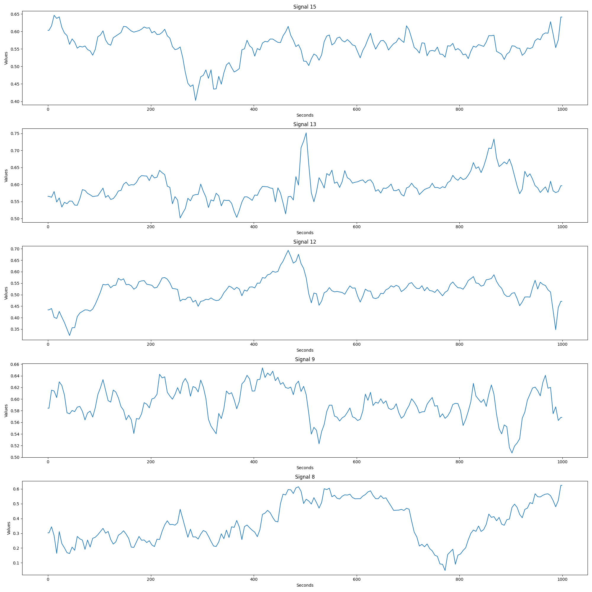

# FHR Signal Generation using CTGGAN

## Introduction
In this project, we have successfully developed a novel method for generating high-quality Fetal Heart Rate (FHR) signals. The methodology leverages a Self-Attention and Risidual Conditional GAN Network trained with Gradient Penalty (GP) to enhance the training stability and the quality of generated signals. Our approach significantly advances the synthesis of FHR signals, potentially aiding diverse clinical and research endeavors in fetal health analysis. The dataset used for this project can be downloaded from the following open-source repository: [CTU-UHB CTG Database](https://physionet.org/content/ctu-uhb-ctgdb/1.0.0/).

## Files
- `model.py`: This code file containing the implementation of the CTGGAN model.
- `train.py`: This code file containing the implementation of the training process.
- `generate.py`: This code file containing the implementation of the generating FHR signal.

## Visualization

### Generated Signal Samples

## Setup
To set up and install the necessary environments and dependencies, follow the steps below:

1. Ensure that you have Python 3.11.4, PyTorch 2.0 and cuda 11.8 installed on your system. 
2. Install the necessary packages mentioned in the code file.
3. Download the datasets and preprocessing it.

